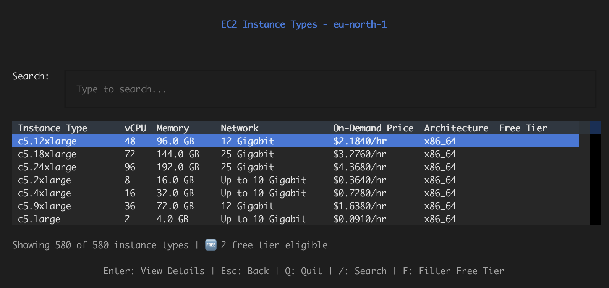

# Instancepedia - EC2 Instance Type Browser

A Terminal User Interface (TUI) application for browsing AWS EC2 instance types with detailed information and free tier eligibility.



## Features

- 🗺️ **Region Selection**: Browse instance types for any AWS region you have access to
- 📋 **Instance List**: View all available EC2 instance types with key metrics
- 💰 **Pricing Information**: See on-demand and spot prices for each instance type
  - Prices load in the background for all instance types
  - Batch fetching for optimal performance
  - Automatic retry with exponential backoff on rate limits
- 💵 **Cost Calculator**: Automatic calculation of monthly and annual costs, plus cost per vCPU and GB RAM
- 🔍 **Search & Filter**: Search by instance type name, filter by free tier eligibility
- 📊 **Detailed Information**: Comprehensive details for each instance type including:
  - Compute specifications (vCPU, cores, threads)
  - Memory information
  - Network performance
  - Storage options (EBS, instance store)
  - Architecture support
  - Pricing and cost analysis with spot price savings
- 🆓 **Free Tier Indicators**: Clearly marked free tier eligible instances
- ⚡ **Fast Navigation**: Smooth screen transitions with loading indicators
- 🐛 **Debug Mode**: Scrolling debug log for troubleshooting (use `--debug` flag)

## Installation

1. Install dependencies:
```bash
pip install -r requirements.txt
```

2. Configure AWS credentials (one of the following):
   - Run `aws configure`
   - Set environment variables: `AWS_ACCESS_KEY_ID`, `AWS_SECRET_ACCESS_KEY`
   - Use an AWS profile: `export AWS_PROFILE=your-profile`

## Usage

Run the application:
```bash
python3 -m src.main
```

Or with debug mode enabled (shows scrolling debug log):
```bash
python3 -m src.main --debug
```

**Note**: Pricing information loads in the background after instance types are displayed. You'll see a progress indicator showing how many prices have been loaded. The application uses parallel requests and batch processing to fetch pricing efficiently, with automatic retry logic for rate-limited requests.

Or install as a package and run:
```bash
pip install -e .
instancepedia
```

### Keyboard Shortcuts

#### Region Selector
- `↑` `↓` - Navigate regions
- `Enter` - Select region
- `Esc` / `Q` - Quit

#### Instance List
- `↑` `↓` - Navigate list
- `Enter` - View details
- `/` - Focus search
- `F` - Toggle free tier filter
- `Esc` - Back to region selector
- `Q` - Quit

#### Instance Detail
- `Esc` - Back to list
- `Q` - Quit

## Configuration

You can configure the application using environment variables:

- `INSTANCEPEDIA_AWS_REGION` - Default AWS region (default: us-east-1)
- `INSTANCEPEDIA_AWS_PROFILE` - AWS profile to use

## IAM Permissions

Instancepedia requires minimal AWS permissions to function. The application needs read-only access to EC2 instance type information and pricing data.

### Required IAM Policy

Create an IAM policy with the following JSON:

```json
{
    "Version": "2012-10-17",
    "Statement": [
        {
            "Effect": "Allow",
            "Action": [
                "ec2:DescribeRegions",
                "ec2:DescribeInstanceTypes",
                "ec2:DescribeSpotPriceHistory"
            ],
            "Resource": "*"
        },
        {
            "Effect": "Allow",
            "Action": [
                "pricing:GetProducts"
            ],
            "Resource": "*"
        }
    ]
}
```

**Note**: The `pricing:GetProducts` permission is required to display on-demand pricing. The `ec2:DescribeSpotPriceHistory` permission is required to display current spot prices. If you don't need pricing information, you can omit these permissions and the application will still function (pricing will show as "N/A").

The application handles AWS API rate limiting automatically with exponential backoff retry logic, so you don't need to worry about rate limit errors.

### Setting Up IAM Permissions

1. **Create the policy** (using AWS CLI):
   ```bash
   aws iam create-policy \
     --policy-name InstancepediaReadOnly \
     --policy-document file://instancepedia-policy.json
   ```

2. **Attach the policy to a user**:
   ```bash
   aws iam attach-user-policy \
     --user-name YOUR_USERNAME \
     --policy-arn arn:aws:iam::ACCOUNT_ID:policy/InstancepediaReadOnly
   ```

3. **Or attach to a role** (for EC2 instances, Lambda, etc.):
   ```bash
   aws iam attach-role-policy \
     --role-name YOUR_ROLE_NAME \
     --policy-arn arn:aws:iam::ACCOUNT_ID:policy/InstancepediaReadOnly
   ```

**Note**: Replace `YOUR_USERNAME`, `YOUR_ROLE_NAME`, and `ACCOUNT_ID` with your actual values.

Alternatively, you can use the AWS Console:
1. Go to IAM → Policies → Create policy
2. Select JSON tab and paste the policy above
3. Name it `InstancepediaReadOnly` and create it
4. Attach it to your user or role as needed

## Performance

Instancepedia is optimized for performance:

- **Parallel Pricing Fetching**: Uses thread pools to fetch pricing data concurrently
- **Batch Spot Price Queries**: Fetches spot prices in batches of up to 50 instance types per API call
- **Automatic Retry**: Handles rate limiting with exponential backoff (1s, 2s, 4s, etc.)
- **Background Loading**: Pricing loads in the background so you can browse instance types immediately

## Requirements

- Python 3.8+
- AWS credentials configured
- boto3
- textual
- pydantic

## Project Structure

```
instancepedia/
├── src/
│   ├── models/          # Data models
│   ├── services/        # AWS service wrappers
│   ├── ui/              # TUI screens
│   ├── config/          # Configuration
│   ├── app.py           # Main application
│   └── main.py          # Entry point
├── requirements.txt
└── README.md
```

## License

MIT

